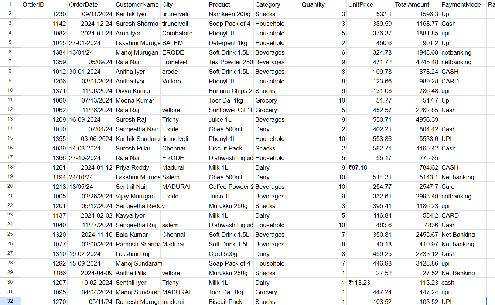
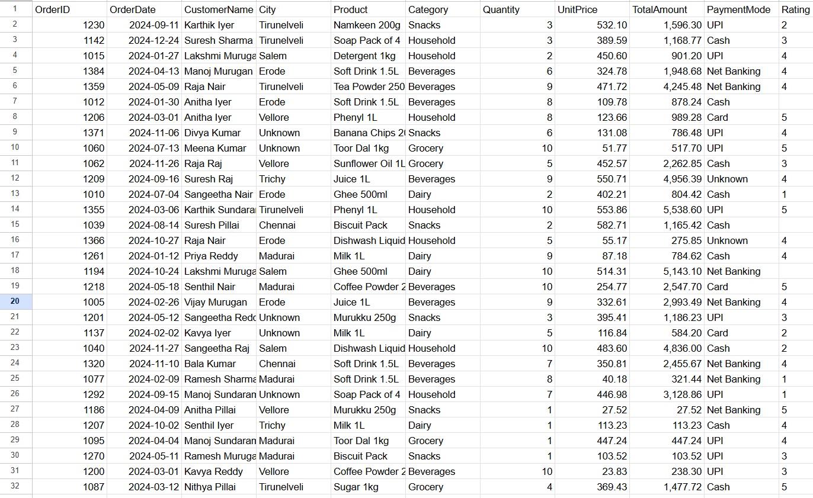
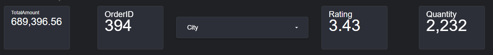
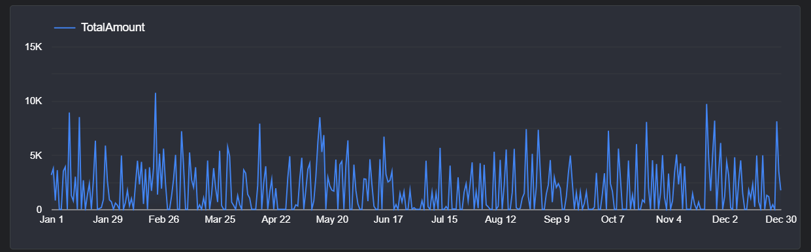
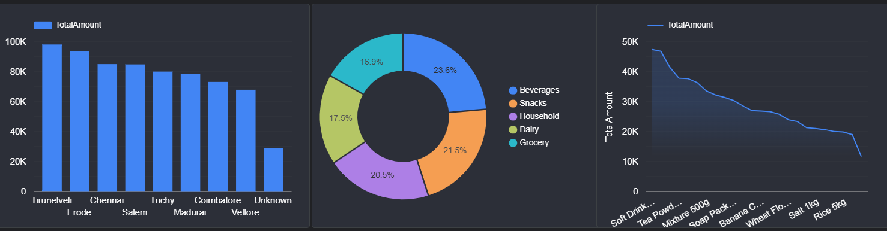

# Tamil Nadu Retail Sales Dashboard - 2024

A data cleaning and dashboard project analyzing a year of retail sales data across cities in Tamil Nadu, covering grocery, dairy, snacks, beverages, and household product categories.

**Live Dashboard:** [View on Looker Studio](https://datastudio.google.com/reporting/374920a9-1a37-4f91-bad9-1b33d10a72a3)

---

## Tools Used
- **Google Sheets** - data cleaning and preparation
- **Looker Studio** - dashboard and visualization

## Dataset
The dataset contains 414 raw sales records from a retail business, with fields for order ID, order date, customer name, city, product, category, quantity, unit price, total amount, payment mode, and rating.

The raw data came with several real-world quality issues that needed to be fixed before it was usable for analysis.

## Data Cleaning Steps

I went through the following cleaning process in Google Sheets:

1. **Removed duplicate rows** - a few orders were entered twice with identical values.
2. **Standardized city names** - the City column had mixed capitalization (`chennai`, `CHENNAI`, `Chennai`), typos (`Chenai`, `Combatore`, `Trunelveli`), and extra whitespace. Cleaned these up so each city has one consistent spelling.
3. **Standardized payment modes** - `UPI`, `upi`, `Upi` and similar inconsistent casing were unified into consistent categories (UPI, Cash, Card, Net Banking).
4. **Fixed inconsistent date formats** - dates were mixed across DD-MM-YYYY, MM/DD/YYYY, YYYY-MM-DD and DD/MM/YY formats in the same column. Converted everything to one standard format.
5. **Cleaned currency formatting** - some UnitPrice values had a ₹ symbol mixed in with plain numbers, which meant the column wasn't being read as numeric. Removed the symbol and confirmed the column was numeric.
6. **Verified TotalAmount calculations** - checked TotalAmount against Quantity × UnitPrice and corrected rows where they didn't match.
7. **Fixed invalid Quantity values** - a few rows had negative quantities, which isn't valid for a sales record.
8. **Handled missing values** - left blank Rating values as blank instead of filling with 0 (so they wouldn't skew the average), and grouped blank City values under "Unknown" rather than guessing.
9. **Caught an outlier during dashboard building** - after connecting the cleaned data to Looker Studio, I noticed one row was throwing off every chart (a single order worth ~₹10 lakh dominating the whole revenue trend). Traced it back to a bad test entry that had slipped through the first cleaning pass and removed it.
10. **Merged inconsistent city variants** - noticed "Trichy" and "Tiruchirapalli" were showing up as separate bars in the dashboard even after the first cleaning pass, since they're the same city. Went back and merged them.

## Before & After Cleaning

**Raw data (before cleaning):**



**Cleaned data (after cleaning):**



## Dashboard

**Key metrics:** Total Revenue, Total Orders, Average Rating, Total Quantity Sold — with a City filter to drill down.



**Revenue trend across 2024:**



**Revenue by city, category split, and top products:**



## Key Insights

- **Tirunelveli generated the highest revenue** among all cities, followed by Erode and Chennai — Vellore had the lowest sales volume of the tracked cities.
- **Category-wise revenue was fairly balanced**, with Beverages leading at 23.6% of total revenue, followed by Snacks (21.5%) and Household items (20.5%). No single category dominated the business.
- **Soft drinks and tea powder were the top-selling products by revenue**, which makes sense given Beverages was the top category overall.
- **Average customer rating was 3.43/5** — not bad, but there's room to improve. Would be worth digging into which cities or products have lower ratings if more granular feedback data were available.
- If I had more data, I'd want to look at **seasonal patterns** more closely — the trend chart shows a lot of day-to-day volatility, and it would help to see if certain months consistently perform better.

## Project Structure
```
├── Raw-Data/
│   └── raw_sales_data.csv
├── Cleaned-Data/
│   └── cleaned_sales_data.csv
├── Screenshots/
│   ├── Raw_data.png
│   ├── Cleaned_data.png
│   ├── Top.png
│   ├── Middle.png
│   └── Bottom.png
└── README.md
```
